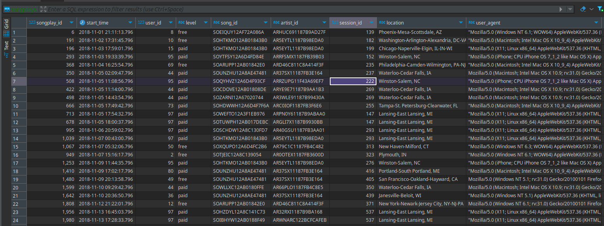

## Data Warehouse for Song Play Analysis

### Project Overview
This project develops a data warehouse for analyzing song listening behavior in a music streaming application. It integrates song metadata with user listening logs to enable comprehensive analysis.

### Schema
The Sparkify analytics database schema has a star design as the table below with 1 fact tables and 4 dimension tables.
 

### Technical Implementation
* **Data Sources:** Song metadata and user listening logs stored in S3.
* **Data Warehouse:** Amazon Redshift cluster for efficient data storage and query performance.
* **ETL Process:** Python scripts handle data extraction, transformation, and loading (ETL) into Redshift.
* **Data Model:** Star schema with `songplays` as the fact table and `users`, `songs`, `artists`, and `time` as dimension tables.

### Project Structure
* **`create_tables.py`**: Creates and drops tables in the Redshift database.
* **`dwh.cfg`**: Stores configuration details for the Redshift cluster.
* **`etl.py`**: Orchestrates the ETL process, copying data from S3 to staging tables and loading into the data warehouse.
* **`sql_queries.py`**: Contains SQL statements for table creation, data loading, and other database operations.

### Project Execution
1. **Set up environment:** Configure Redshift database details in `dwh.cfg`.
2. **Create tables:** Run `python create_tables.py`.
3. **Execute ETL:** Run `python etl.py`.
4. **(Optional) Delete resources:** Delete Redshilf cluster using AWS console.

### Future Enhancements
* Implement robust data quality checks.
* Develop a user-friendly dashboard for data visualization and exploration.

### Result
 

By leveraging a star schema and efficient data loading processes, this project provides a solid foundation for in-depth music listening analysis.